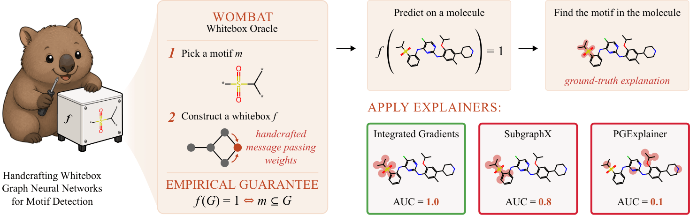
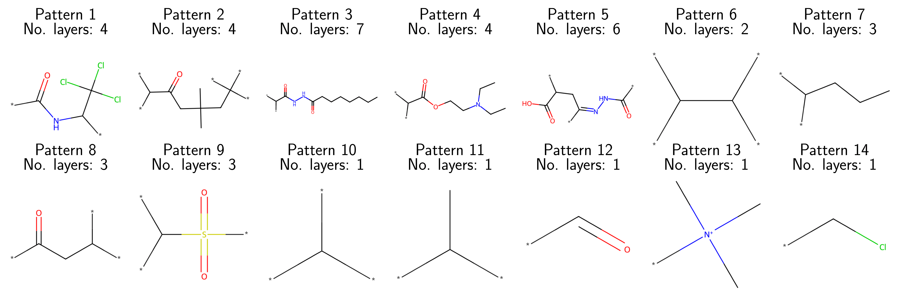
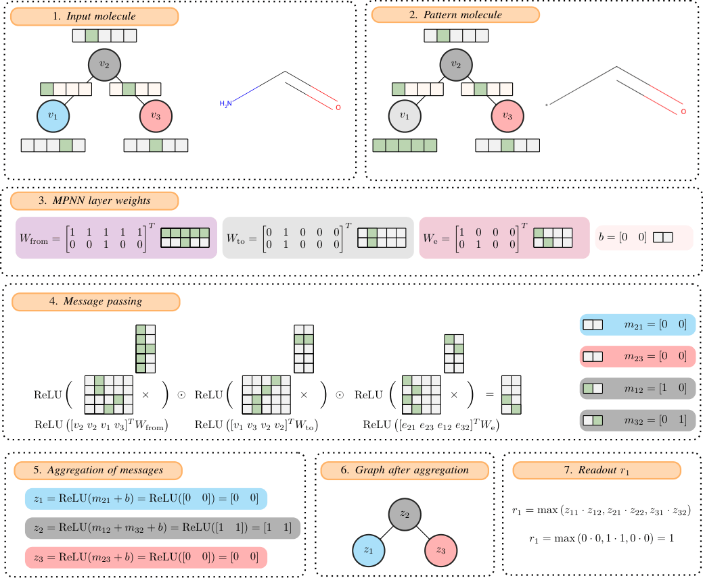

# WOMBAT

This repository contains the code used to conduct the experiments mentioned in the paper
`WOMBAT: Whitebox Oracle for Molecular Benchmarking and Attribution Testing`.

The paper is available here: https://arxiv.org/abs/2610.00713

## Dataset

The dataset used for validating the whiteboxes (sourced from PubChem, as described in the paper) can be found
here: https://huggingface.co/datasets/dmtsh/wombat-smiles

## Repository structure

### Artifacts

* `artifacts/explainability_method_tester/R1` contains raw data from testing explainability methods on
  readout r_1 (main testing suite).
* `artifacts/explainability_method_tester/R2` contains raw data from testing explainability methods on
  readout r_2 (main testing suite).

These artifacts are used in various notebooks in the repository for the purpose of performing qualitative and
quantitative analysis.

### Dataset preparation

* `scripts/create_dataset_local.py` converts `ttl.gz` files downloaded from PubChem's FTP server into a CSV.

* `scripts/filter_dataset_local.py` filters the aforementioned CSV file (as described in the paper) and generates ECFP4
  fingerprints for all molecules.

* `wombat/dataset/pubchem_processed_smiles_dataset.py` contains the code used to sample from all the filtered PubChem molecules
  to create whitebox validation datasets (as described in the paper).

* `run_benchmark.py` run the benchmark. Note that this file can be modified to test different XAI methods to your
  liking.

### Whiteboxes

* The MPNN architecture (as described in the paper) is implemented in `wombat/mpnn/mpnn_arch.py`; the input encoding is located
  in `wombat/mpnn/molecule_converter.py`.

* The whitebox validation code is located in the files `test.py` and `wombat/mpnn/validate_whiteboxes.py`.

* Whiteboxes for specific patterns (as described in the paper) are localised in the following files:

    - Pattern 1: `wombat/mpnn/molecule_c_detector.py`
    - Pattern 2: `wombat/mpnn/molecule_e_detector.py`
    - Pattern 3: `wombat/mpnn/molecule_f_detector.py`
    - Pattern 4: `wombat/mpnn/molecule_g_detector.py`
    - Pattern 5: `wombat/mpnn/molecule_h_detector.py`
    - Pattern 6: `wombat/mpnn/molecule_i_detector.py`
    - Pattern 7: `wombat/mpnn/molecule_j_detector.py`
    - Pattern 8: `wombat/mpnn/molecule_k_detector.py`
    - Pattern 9: `wombat/mpnn/molecule_l_detector.py`
    - Pattern 10: `wombat/mpnn/molecule_m_detector.py`
    - Pattern 11: `wombat/mpnn/molecule_n_detector.py`
    - Pattern 12: `wombat/mpnn/molecule_o_detector.py`
    - Pattern 13: `wombat/mpnn/molecule_p_detector.py`
    - Pattern 14: `wombat/mpnn/molecule_q_detector.py`

* The file `wombat/mpnn/visualize_activations.py` contains functions that can be used to visualise internal activations in
  MPNNs. It highlights which elements of the latent vector had values > 0.5, essentially meaning they were activated.
    * It uses a specific notation, where the activation of the n-th element of the latent vector in the i-th layer is
      denoted as `{N-th letter of the alphabet}.{i}`. For example, `F.2` would be the sixth element of the activation
      vector after the second MPNN layer.
* Models, along with their respective SMARTS, can be found in the file `wombat/krfp_models.py`.
* `scripts/krfp_smarts.json` contains all KRFP SMARTS; `scripts/krfp_vis.py` is a helper script to visualise them (we used it to pick
  acyclical motifs that seemed tractable).
* Furthermore, there are additional models included (not parts of the main testing suite):
    * `wombat/mpnn/gine_experiments` contains GINE-Flucarb whitebox (described in the paper), which uses a different
      architecture (validated in `scripts/test_flucarb_gine.py`).
    * `wombat/mpnn/molecule_o_variants` contains different variants of whiteboxes detecting Pattern 12 (validated in
      `test_mol_o_variants.py`).
    * `wombat/mpnn/vibe_coding` -- created by GPT-5.6 Sol (validated in `test_vibecoded_whiteboxes.py`). This whitebox
      detects [CHD2]=NN=[CHD2] SMARTS from KRFP (different from our Patterns). It was created to assess if LLMs could
      possibly allow us to scale WOMBAT to more patterns. We do not discuss it in the paper and XAI methods were not
      tested on it; it's not a part of our main testing suite.

### WOMBAT Whitebox Architecture 

### XAI evaluation

* `wombat/ground_truth/highlight_smarts.py` is used to derive the ground truth from SMARTS strings.

* The directory `wombat/xai_methods` contains classes implementing the `AttributionMethod` interface, returning the
  attributions of a given model according to a specific XAI method.

* The directory `wombat/xai_testers` contains `explainability_method_tester.py`, which performs tests of all explainability
  methods (as described in the paper) and saves them (with a timestamp) to the `artifacts/explainability_method_tester`
  directory. It also contains `gnn_explainer_grid.py` and `pgexplainer_grid.py`, used to test more specific
  hyperparameters of these explainers.

### Notebooks

* Notebooks used to perform some paper's analyses are provided in the `notebooks` directory. Among others:
* `notebooks/create_figures.ipynb` is used to show the distributions of Tanimoto and Tversky distances towards specific patterns
  and to generate tables for the main results.
* `notebooks/gnn_explainer_grid.ipynb` and `notebooks/pge_grid_results.ipynb` are used to analyse the results of GNN Explainer and PGE
  Explainer.
* `notebooks/show_explanations.ipynb` is used to generate an example explanation for visualisation purposes in the paper.
* For further qualitative analysis on Integrated Gradients, the notebooks `notebooks/ig_fails_pattern_4.ipynb` and
  `notebooks/ig_fails_pattern_5.ipynb` are also provided.
* We analyse PGExplainer's shortcut problem in `notebooks/pge_shortcut.ipynb`.
* We analyse results of the "atypical" whiteboxes (i.e. the ones with different weight settings) in
  `notebooks/results_for_atypical_whiteboxes.ipynb`.
* We calculate correlation between original and relaxed SMARTS in `notebooks/smarts_correlation.ipynb`.
* We check for any differences in ground truth after relaxation of SMARTS for Pattern 3 and 5 in `notebooks/gt_match.ipynb`.
